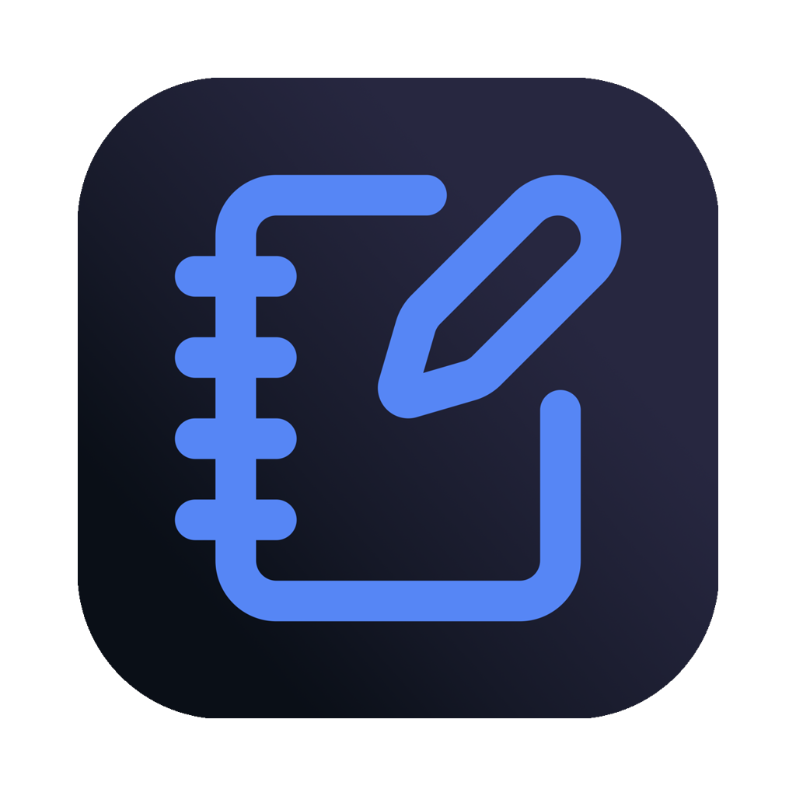

<div align="center">
  
  <h1>PDF Hand-Out Studio</h1>
  <p>A simple, privacy-first tool for turning PDF presentations into printable handout sheets.<br> Everything runs in your browser, your files never leave your device.</p>

https://hand-outs.com

[](https://hand-outs.com) [](LICENSE) [](https://nextjs.org/) [](#privacy) [](#privacy)

</div>

---

## What is this?

If you've ever needed to print out lecture slides, meeting decks, or any multi-page PDF as a compact handout (2, 4, 6, or 9 slides per page), this is for you. Just drag and drop your PDF, pick a layout, and download the result. No sign-up, no uploads, no waiting.

<br>

<div align="center">
  
</div>

<br>

---

## Why This Exists

I got tired of the same frustrating cycle every time I needed to print lecture slides:

- **Adobe Acrobat?** Buried in menus, confusing options, requires a subscription.
- **Online tools?** Upload my confidential slides to some random server? No thanks.
- **Desktop apps?** Install sketchy software just to print 4 slides per page?

I just wanted something simple: drag, drop, done. So I built it.

No accounts. No uploads. No tracking. Just a tool that respects your time and your privacy.

---

## Features

- **Drag & drop upload** — Just drop your PDF and you're ready to go
- **Multiple layouts** — 1, 2, 3, 4, 6, or 9 slides per page, portrait or landscape
- **Live preview** — See exactly what you'll get before exporting
- **Fine-tuned control** — Adjust margins, spacing, scale, frames, and page numbers
- **Built-in templates** — One-click presets for common use cases
- **Notes lines** — Optional ruled lines for taking notes
- **Slide selection** — Include only the pages you need
- **Hide repeated elements** — Automatically detects and removes recurring headers, footers, ... from slides
- **Dark/light mode** — Follows your system preference (or toggle manually)
- **Completely private** — All processing happens locally in your browser

---

## Getting Started

### Use it online

The easiest way is to use the hosted version (if deployed). No installation needed. https://hand-outs.com

### Run it locally

```bash
# Clone the repo
git clone https://github.com/flodlol/pdf-handout-studio.git
cd pdf-handout-studio

# Install dependencies
npm install

# Start the dev server
npm run dev
```

Then open [http://localhost:3000](http://localhost:3000) in your browser.

### Build for production

```bash
npm run build
npm start
```

---

## How It Works

The app is built with **Next.js 14** using the App Router, **React 18**, and **TypeScript**.

### Architecture

```
app/           --> Next.js App Router pages (layout.tsx, page.tsx)
components/    --> React UI components (controls, preview, upload zone, etc.)
lib/           --> Core logic and utilities
styles/        --> Global CSS and Tailwind config
```

### The layout engine

When you configure a handout, the layout engine (`lib/layoutEngine.ts`) calculates the exact positions and sizes for each slide slot on the output page. It handles:

- Grid calculations based on pages-per-sheet and orientation
- Margin and spacing math (all in millimeters, converted to PDF points)
- Slot positioning for consistent layouts

### PDF generation

The actual PDF creation happens in `lib/generateHandout.ts` using **pdf-lib**. This library lets us:

- Embed pages from the source PDF into new pages
- Scale and position each slide precisely
- Add frames, page numbers, and notes lines
- Output a new PDF that preserves vector quality

Since pdf-lib runs entirely in JavaScript, there's no server needed, the browser does all the work.

### Preview rendering

For the live preview, we use **pdfjs-dist** (Mozilla's PDF.js) to render pages to a canvas. The worker is lazy-loaded to keep initial page load fast.

### Theming

Dark and light modes use **next-themes** with CSS variables. Your preference is remembered in localStorage.

---

## Tech Stack

| Category | Technology |
|----------|------------|
| Framework | Next.js 14 (App Router) |
| UI | React 18, TailwindCSS, shadcn/ui |
| PDF Generation | pdf-lib |
| PDF Preview | pdfjs-dist |
| Theming | next-themes |
| Language | TypeScript |

---

## Privacy

This is a big one. **Your PDFs never leave your device.**

- No server uploads
- No analytics tracking your documents
- No cloud processing

The entire app runs client-side. When you "export" a PDF, your browser generates it locally and triggers a download. 

---

## Contributing

Contributions are welcome and appreciated! Whether it's fixing a typo, improving the UI, adding a feature, or just reporting a bug. All help is valued.

### Ways to contribute

- **Bug reports** — Found something broken? Open an issue
- **Feature requests** — Have an idea? Let's hear it
- **Pull requests** — Code contributions are always welcome
- **Documentation** — Help make the README or comments clearer
- **Design feedback** — Suggestions for better UX are great too

### To submit a PR

1. Fork the repo
2. Create a branch (`git checkout -b my-feature`)
3. Make your changes
4. Run `npm run lint` to check for issues
5. Commit and push
6. Open a pull request

No contribution is too small. Even fixing a single typo helps.

---

## License

MIT — do whatever you want with it.

---

## Acknowledgments

- [pdf-lib](https://pdf-lib.js.org/) for making client-side PDF generation possible
- [PDF.js](https://mozilla.github.io/pdf.js/) for reliable PDF rendering
- [shadcn/ui](https://ui.shadcn.com/) for the beautiful component primitives
- Everyone who's given feedback or contributed

---

<div align="center">
  If you find this useful, a star on GitHub would be nice. ⭐ <br/>
  Thanks for checking it out! ❤️
  <br/>
  <a href="https://github.com/sponsors/flodlol">Sponsor this project</a>
</div>
